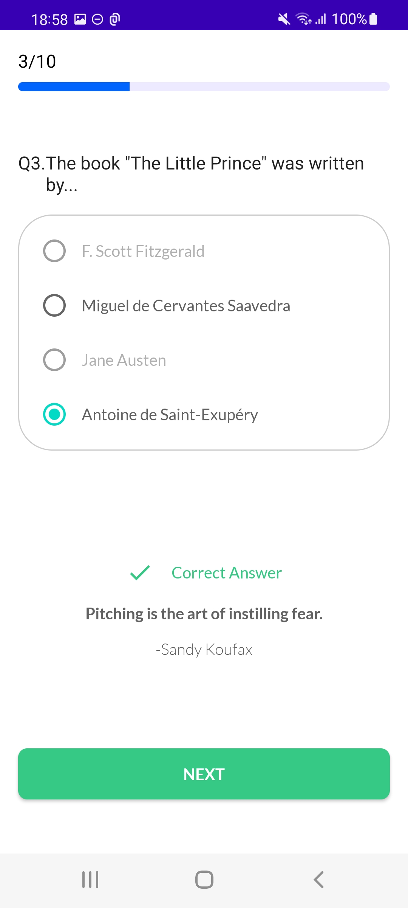
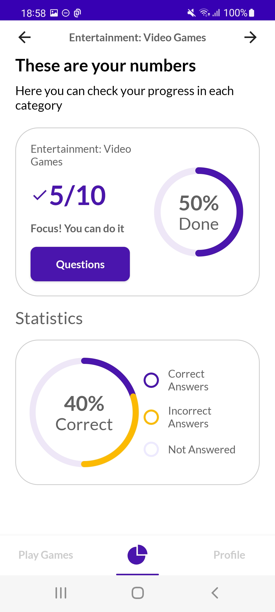

# Super Quiz
## The Brief

An app that lets you answer trivia questions for mind excercise

## Architecture & Libraries

```
- Clean Architecture
- MVI
- Multi-module
- Compose
- Coil (Image Caching)
- Unit Tests
- Hilt Dependency Injection
- Offline First
- Room
- Lottie
- Use Cases
- Retrofit
- Kotlin Coroutines
- Flow
```

## App preview:


Image #1            |  Image #2             |  Image #3           
:-------------------------:|:----------------------------:|:----------------------------:
    |       |  
